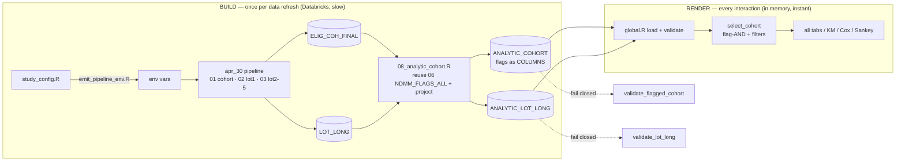

# Cohort Explorer — layout schematic + portability (dataset / LOT)

## 1. How the dashboard looks

```
┌────────────────────────────────────────────────────────────────────────────────────┐
│  Oncology Real-World Data Explorer Tool — MM (Overall & NDMM) · GSK 223926           │  header
│  [ SYNTHETIC DATA — not for analysis ]  (red banner shows only on a synthetic source)│
├───────────────────────────┬──────────────────────────────────────────────────────────┤
│  SIDEBAR (controls)        │  MAIN (tabs)                                              │
│                            │                                                          │
│  Cohort Selection          │  [Patient Characteristics][OS][TTD][TTNT][Attrition]     │
│   ▼ Overall / NDMM         │  [PFS*][Regimen & Transitions][Adjusted & Compare]       │
│   (Apply Cohort)           │  [Cohort & Attrition][Validation & Checks]               │
│                            │  ┌────────────────────────────────────────────────────┐ │
│  Analysis options          │  │ KPI strip:  N selected · % of superset · superset N │ │
│   • Line of therapy 1L/2L/3L│ │             · active cohort · line of therapy        │ │
│   • ☑ min follow-up (mo) ── │  ├────────────────────────────────────────────────────┤ │
│   • min-FU slider 0–24     │  │ Patient Characteristics                             │ │
│   • landmark times 6,9,12… │  │   Select variables ▾   Select strata ▾   [Apply]   │ │
│                            │  │   Categorical  N / %   (Overall + per-stratum cols) │ │
│  Inclusion / Exclusion     │  │   Continuous   mean/SD/median/IQR + Missing         │ │
│   accordion (registry-     │  │   Baseline safety events  n / % + rate per 100 PY   │ │
│   driven):                 │  ├────────────────────────────────────────────────────┤ │
│    ▸ Demographics          │  │ OS / TTD / TTNT / Attrition (per selected line):    │ │
│       age slider, sex,     │  │   horizon ── strata ▾ [Apply]                       │ │
│       region, age≥70…      │  │   ┌───────── KM curve ─────────┐  Landmark 6/9/12/  │ │
│    ▸ Clinical (CCI, comorb)│  │   │  S(t) by stratum          │  18/24: N-risk /    │ │
│    ▸ Labs (extensible)     │  │   └───────────────────────────┘  events / cens / CI │ │
│    ▸ Treatments (SOC, IE   │  │   Median (95% CI)  ·  Number at risk                 │ │
│       flags, no-belantamab)│  ├────────────────────────────────────────────────────┤ │
│    ▸ Other (CE months,     │  │ Regimen & Transitions:  freq per line               │ │
│       dx-year, 1L-yr,      │  │   pathway depth ── ☑ commercial-only                │ │
│       payer)               │  │   ┌── 1L → 2L → 3L → 4L Sankey (→ "End") ──┐         │ │
│    (Apply Filters)         │  │   └────────────────────────────────────────┘         │ │
│                            │  │   per-stage transition table                        │ │
│                            │  ├────────────────────────────────────────────────────┤ │
│                            │  │ Adjusted & Compare:                                 │ │
│                            │  │   endpoint ▾  covariates ▾  [Fit Cox] → HR (95% CI) │ │
│                            │  │   [Save→A] [Save→B] [Compare]  → KM overlay A vs B   │ │
│                            │  ├────────────────────────────────────────────────────┤ │
│                            │  │ Validation & Checks: LOT structural · NDMM protocol │ │
│                            │  │   conformance · data-quality (≥N-mo denom, missing, │ │
│                            │  │   <25 suppression)                                  │ │
│                            │  └────────────────────────────────────────────────────┘ │
└───────────────────────────┴──────────────────────────────────────────────────────────┘
```

Every control is a **runtime, in-memory** operation over the loaded snapshot
(milliseconds) — no query runs on interaction.

## 2. Data flow



## 3. Transition to a **different dataset** (e.g. Optum → Flatiron / MarketScan)

**What changes — only the BUILD side (left box):**
| Layer | Change |
|---|---|
| Codelists | swap the `cl_*` code lists (MM dx, MMA agents, other-cancer, pregnancy, SOC map) for the new source's coding system |
| Adapter / source tables | repoint `01`/`06`/`08` at the new claims/EHR tables; map its demographics (Flatiron adds *practice type / smoking / ECOG*; claims add *region / payer*) into the `[B]` columns |
| `08` projection | adjust the demographic + safety/HCRU joins to the new schema; the flag SQL structure is reused |
| `study_config` | set the source's study window, `lot1_from`, CE windows |

**What does NOT change — the entire RENDER side (right box):** the Shiny app,
the flag engine (`select_cohort`), summaries, KM/Cox, Sankey, the criteria
registry, the **contract** (`FLAGGED_COHORT_BASE_COLS` + `registry_flag_ids`),
and the full test suite (101 engine + 17 app). As long as the new build emits the same contract columns, the
dashboard renders it unchanged. That is the point of the contract: the dashboard
is **dataset-agnostic**; only the materialization is dataset-specific.

*New source has extra fields (e.g. Flatiron ECOG/labs)?* Add a column + one
`variable_dictionary()` / registry entry → it appears as a characteristic /
stratum / covariate / filter automatically. The empty **Labs** accordion bucket
is already there for exactly this.

## 4. Transition to a **different LOT**

Two distinct senses — the tool already handles both:

**(a) Analyze outcomes at a later line (2L / 3L) within the same cohort** —
*runtime, already built.* The **Line of therapy** selector re-anchors the KM /
regimen / pathway views to that line off `ANALYTIC_LOT_LONG` (per-line TTE,
current-line SOC stratum). Nothing to rebuild; it's a dropdown.

**(b) Make a later line the *index* cohort (e.g. a 2L RRMM cohort with its own
IE criteria)** — *mostly config.* The protocol already defines 2L/3L RRMM
cohorts (subsequent-LOT + 12-mo pre-line CE + 3-mo follow-up CE). To add one:
1. **`cohort_definitions()`** — add a `rrmm_2l` entry with its default active
   flag set (reusing the same registry criteria, re-anchored to the 2L index).
2. **`criteria_registry()`** — add any line-specific flags (e.g.
   `incl_received_2l`); each just needs a column on the analytic cohort.
3. **`08` / build** — emit those flag columns anchored at the 2L index (the
   pattern is identical to `06`'s LOT1 anchoring, shifted a line).
4. Dashboard, engine, tests: **unchanged** — the new cohort appears in the
   dropdown next to Overall / NDMM.

So a new *line-anchored cohort* is a study-config + flag-set addition (build
side), while *viewing existing lines* is already a runtime dropdown. Neither
touches the dashboard or the validated algorithm.
